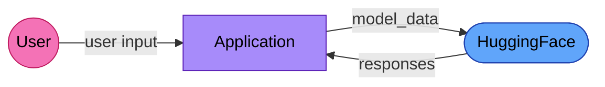

# EU AI Act Compliance Package

> Generated by AI Trace Auditor v0.10.0
> **One codebase scan. Three articles covered. This is a starting point, not legal advice.**

**Generated:** 2026-03-18 19:29 UTC
**Source:** `/Users/bipinrimal/Downloads/Website/Projects/dawym`
**Files scanned:** 34

---

## Coverage Summary

| Article | Status | Key Metric |
|---------|--------|------------|
| Article 12 — Record-Keeping | ⚠️ No traces | Provide `--traces` for audit |
| Article 11 — Technical Documentation | ✅ Generated | 33% auto-populated |
| Article 13 — Transparency | ✅ Mapped | 1 services, 1 flows |
| GDPR Article 30 — RoPA | ✅ Generated | 1 processing activities |

**Articles covered:** Article 11 (Technical Documentation), Article 13 (Transparency), GDPR Article 30 (RoPA)

---

# Part 2: Article 11 — Technical Documentation (Annex IV)

**Sections auto-populated:** 3 / 9 (33%)

| # | Section | Status | Confidence |
|---|---------|--------|------------|
| 1 | General Description of the AI System | ✅ Auto | medium |
| 2 | Detailed Description of Elements and Development Process | ✅ Auto | medium |
| 3 | Monitoring, Functioning, and Control | 📝 Manual | manual |
| 4 | Appropriateness of Performance Metrics | 📝 Manual | manual |
| 5 | Risk Management System | ✅ Auto | low |
| 6 | Lifecycle Changes | 📝 Manual | manual |
| 7 | Applied Harmonised Standards | 📝 Manual | manual |
| 8 | EU Declaration of Conformity | 📝 Manual | manual |
| 9 | Post-Market Monitoring System | 📝 Manual | manual |

## Section 1: General Description of the AI System

### AI Providers and SDKs Detected

- **huggingface** (1 import)

### Model Identifiers

- `claude-haiku-4-5-20251001`
- `whisper-base.en`
- `whisper-small.en`
- `whisper-tiny.en`

### Intended Purpose

[MANUAL INPUT REQUIRED]

*Describe the intended purpose and use cases of this AI system.*

### Target Users and Deployment Context

[MANUAL INPUT REQUIRED]

*Describe who will use this system and in what context.*

### Version History

[MANUAL INPUT REQUIRED]

---

## Section 2: Detailed Description of Elements and Development Process

### Software Components (Auto-Detected)

- **huggingface**: `@huggingface/transformers`

### Models Used

| Model | Location | Context |
|-------|----------|---------|
| `claude-haiku-4-5-20251001` | /Users/bipinrimal/Downloads/Website/Projects/dawym/app/src/lib/verdict.ts:4 | const MODEL = 'claude-haiku-4-5-20251001' |
| `whisper-tiny.en` | /Users/bipinrimal/Downloads/Website/Projects/dawym/app/src/types.ts:182 | onnxModel: 'onnx-community/whisper-tiny.en', |
| `whisper-base.en` | /Users/bipinrimal/Downloads/Website/Projects/dawym/app/src/types.ts:189 | onnxModel: 'onnx-community/whisper-base.en', |
| `whisper-small.en` | /Users/bipinrimal/Downloads/Website/Projects/dawym/app/src/types.ts:196 | onnxModel: 'onnx-community/whisper-small.en', |

### Algorithm Description

[MANUAL INPUT REQUIRED]

*Describe the algorithms and approaches used, design choices, and rationale.*

### Development Methodology

[MANUAL INPUT REQUIRED]

*Describe the development process, version control, and quality assurance.*

---

## Section 3: Monitoring, Functioning, and Control

> ⚠️ This section requires manual input.

### Human Oversight Measures

[MANUAL INPUT REQUIRED]

*Describe human-in-the-loop mechanisms, override capabilities, and escalation procedures.*

### Logging and Monitoring

[MANUAL INPUT REQUIRED]

*Tip: Run `aitrace audit` on your trace data to auto-populate this section.*

---

## Section 4: Appropriateness of Performance Metrics

> ⚠️ This section requires manual input.

### Metric Selection Rationale

[MANUAL INPUT REQUIRED]

*Explain why these metrics were chosen and how they relate to the system's intended purpose.*

### Bias and Fairness Metrics

[MANUAL INPUT REQUIRED]

*Describe any fairness metrics, bias detection, and testing across demographic groups.*

### Performance Thresholds

[MANUAL INPUT REQUIRED]

*Define acceptable performance thresholds and what happens when they are not met.*

---

## Section 5: Risk Management System

### Risk Assessment Methodology

[MANUAL INPUT REQUIRED]

*Describe the risk assessment methodology used (e.g., FMEA, HAZOP, custom).*

### Identified Risks

[MANUAL INPUT REQUIRED]

*List identified risks, their likelihood, severity, and mitigation measures.*

### Residual Risks

[MANUAL INPUT REQUIRED]

*Describe risks that remain after mitigation and their acceptability.*

### Known Risk Surfaces (Auto-Detected)

Based on detected AI usage, the following risk surfaces may apply:

---

## Section 6: Lifecycle Changes

> ⚠️ This section requires manual input.

### Change Management Process

[MANUAL INPUT REQUIRED]

*Describe how changes to the AI system are managed, tested, and deployed.*

### Version Control Policy

[MANUAL INPUT REQUIRED]

### Update Validation Process

[MANUAL INPUT REQUIRED]

---

## Section 7: Applied Harmonised Standards

> ⚠️ This section requires manual input.

### Applicable Standards Checklist

[MANUAL INPUT REQUIRED]

Check all that apply and provide evidence of conformity:

- [ ] ISO/IEC 42001 — AI Management System
- [ ] ISO/IEC 23894 — AI Risk Management
- [ ] ISO/IEC 25059 — AI System Quality
- [ ] ISO/IEC 38507 — Governance of AI
- [ ] ISO/IEC 22989 — AI Concepts and Terminology
- [ ] ISO/IEC 23053 — Framework for AI Systems Using ML
- [ ] Other: ______________________

---

## Section 8: EU Declaration of Conformity

> ⚠️ This section requires manual input.

### Declaration of Conformity

[MANUAL INPUT REQUIRED]

Complete the following fields:

| Field | Value |
|-------|-------|
| AI system name | |
| AI system version | |
| Provider name | |
| Provider address | |
| Authorised representative | |
| Risk classification | |
| Notified body (if applicable) | |
| Date of declaration | |
| Signatory name and function | |

---

## Section 9: Post-Market Monitoring System

> ⚠️ This section requires manual input.

### Monitoring Plan

[MANUAL INPUT REQUIRED]

*Describe how the system will be monitored after deployment.*

### Incident Response Procedures

[MANUAL INPUT REQUIRED]

*Describe how incidents and failures will be detected, reported, and resolved.*

### Feedback Collection

[MANUAL INPUT REQUIRED]

*Describe mechanisms for collecting user feedback and reporting issues.*

---

# Part 3: Article 13 — Data Flow Transparency

**External services:** 1
**Data flows:** 1

## Data Flow Diagram

## External Services

| Service | Category | Type | GDPR Role | PII Risk |
|---------|----------|------|-----------|----------|
| HuggingFace | ai_provider | cloud_api | processor | unknown |

## Data Flows

- **application → HuggingFace** — model_data (inference, GDPR: processor, PII: unknown)

---

# Part 4: GDPR Article 30 — Record of Processing Activities

| Controller | Contact | DPO |
|-----------|---------|-----|
| [MANUAL INPUT REQUIRED] | [MANUAL INPUT REQUIRED] | [MANUAL INPUT REQUIRED] |

| Processing Activity | Purpose | Data Categories | Recipients | Transfers |
|--------------------|---------|-----------------|-----------|-----------|
| Sending model_data to HuggingFace for AI inference | AI-powered content generation and analysis | Model parameters and training data | HuggingFace | Transfer to HuggingFace as processor |

---

## Next Steps

1. Complete all `[MANUAL INPUT REQUIRED]` fields in the Annex IV sections
2. Run `aitrace audit` with production traces for Article 12 compliance scoring
3. Verify PII classifications — flows marked "likely" need DPIA
4. Add GDPR Article 6 legal basis for each processing activity
5. Draft Data Processing Agreements (Article 28) for each "processor" service
6. Set data retention periods for all processing activities
7. Store this package in version control — Article 11 requires it to be kept current
8. Have the package reviewed by a legal/compliance professional

---

*Generated by [AI Trace Auditor](https://github.com/BipinRimal314/ai-trace-auditor) v0.10.0 — open source under Apache 2.0*
*One codebase. One command. Three articles.*